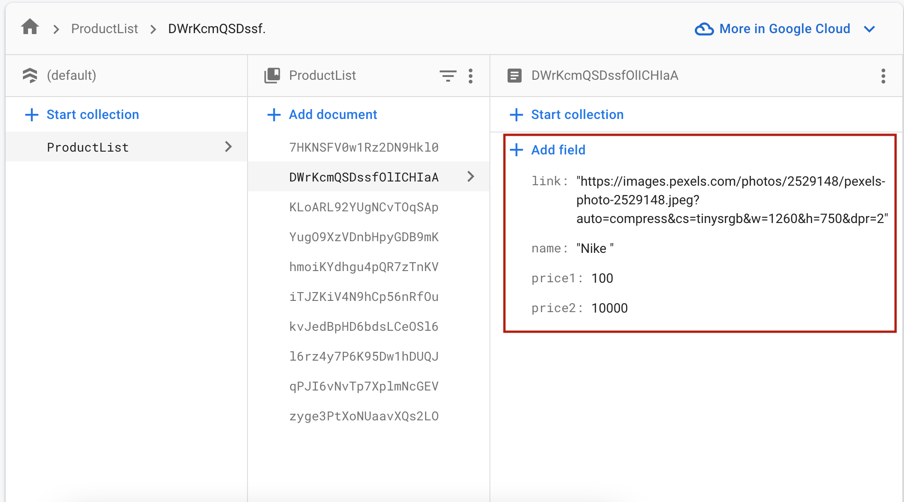
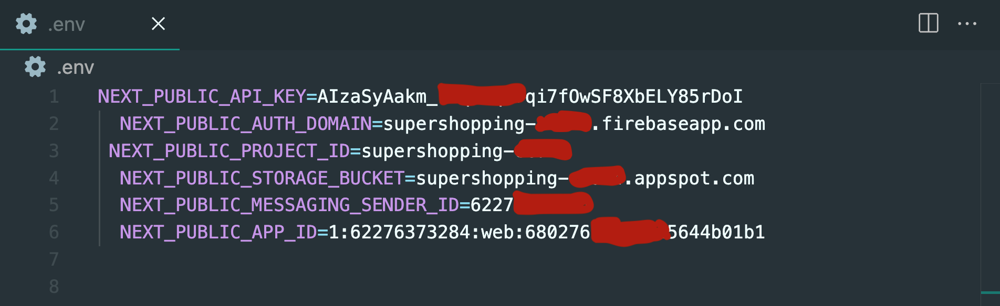

# 🛒 Shopping Cart

This project is buil with Next.js and Tailwindcss

**Shopping Cart** is a project that authenticate users to shop for products on the website.

## 🚀 Live Demo

- [Live Demo Link](https://endearing-bunny-d86298.netlify.app/productpage)

### 🏗 Setup

- You can download the **Zip** file on the GitHub repository, or clone the repository with:

```
git clone https://github.com/Quadry01/shopping-cart.git
```

- Access the cloned directory with:

```
cd shopping-cart
```

- Open it with your favorite code editor

### 🛠 Install

To install linters and other dependencies run:

```
npm install
```

To setup Firebase Authentication

- [Firebase Authentication Tutoria](https://www.youtube.com/watch?v=cZAnibwI9u8)

To create Firestore Database

- [Firestore Database Tutoria](https://www.youtube.com/watch?v=TW02hwhBvo4)
- Create each product on the firestore database following the schema below
  

To Store your firebase credentials

- Create a file named .env in the root folder
- Paste your Firebase credential following the pattern below
- 

  To go live on local server run:

```
npm run dev
```
